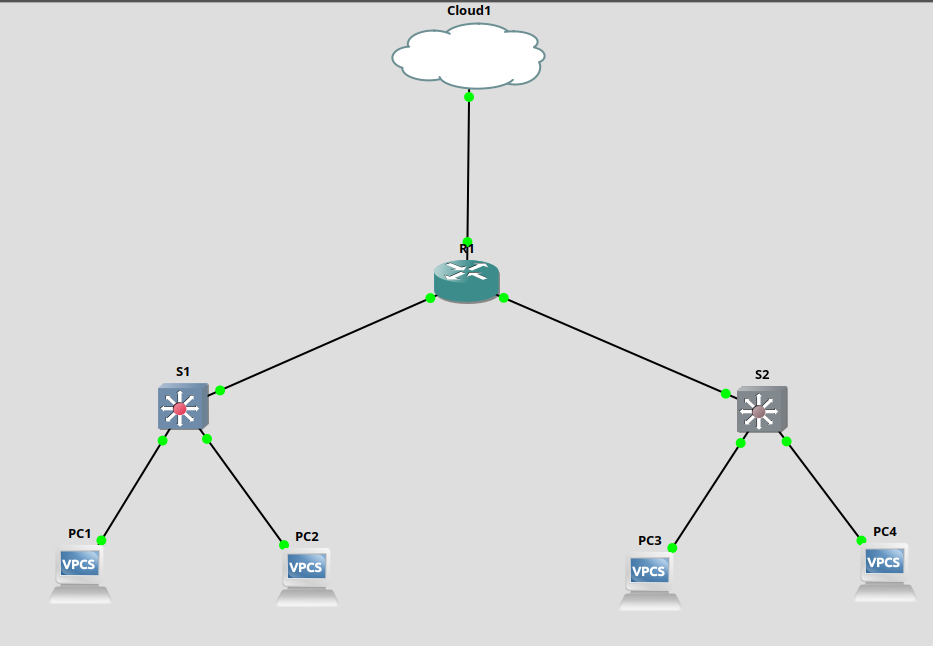

# Automatisation Réseau GNS3 (Cisco IOSv)

Ce projet a pour but d'automatiser le déploiement de configurations réseaux sur une topologie simulée sous GNS3 (Cisco IOSv) via une machine de contrôle Linux.

Deux méthodes d'automatisation sont explorées dans ce dépôt :
1. **Python / Netmiko** : Scripts impératifs pour pousser la configuration.
2. **Ansible** : Playbooks déclaratifs pour la gestion de configuration (IaC).

## 1. Topologie du Réseau

Le réseau est constitué d'un routeur central (Router-on-a-Stick) et de deux commutateurs de distribution.


| Équipement | Rôle | Interface Gestion | IP Gestion | VLAN Gestion |
| :--- | :--- | :--- | :--- | :--- |
| **Linux** | Contrôleur | `tap0` | `172.16.1.10` | N/A |
| **R1** | Passerelle | `Fa1/0` | `172.16.1.1` | N/A |
| **S1** | Switch Access | `Vlan99` | `172.16.99.2` | 99 |
| **S2** | Switch Access | `Vlan100` | `172.16.100.2` | 100 |

## 2. Prérequis & Configuration Initiale (Bootstrap)

⚠️ **IMPORTANT :** Avant de lancer le moindre script, une configuration manuelle est **obligatoire** pour établir la connectivité SSH de base. 

### A. Configuration du Routeur (R1)
Le routeur doit permettre au Linux de joindre les VLANs de management des switchs.

```bash
! Console R1
enable
conf t
hostname R1
no ip domain lookup
ip domain name lab.local
crypto key generate rsa modulus 2048
username admin privilege 15 secret admin1234
ip ssh version 2
line vty 0 4
 transport input ssh
 login local
exit

! Interface vers mon pc 
interface FastEthernet1/0
 ip address 172.16.1.1 255.255.255.0
 no shutdown
exit

! Passerelle pour S1 (VLAN 99)
interface FastEthernet0/0
 no shutdown
exit
interface FastEthernet0/0.99
 encapsulation dot1Q 99
 ip address 172.16.99.1 255.255.255.0
 no shutdown
exit

! Passerelle pour S2 (VLAN 100)
interface FastEthernet0/1
 no shutdown
exit
interface FastEthernet0/1.100
 encapsulation dot1Q 100
 ip address 172.16.100.1 255.255.255.0
 no shutdown
end
write memory
```


### B. Configuration des Switchs (S1 et S2)

Les switchs doivent avoir une IP, une passerelle par défaut et un Trunk actif vers le routeur.

Pour S1 :
Bash
```
! Console S1
enable
conf t
hostname S1
no ip routing                 ! Crucial pour que la gateway fonctionne
username admin privilege 15 secret admin1234
crypto key generate rsa modulus 2048
ip ssh version 2
line vty 0 4
 transport input ssh
 login local
exit

! Trunk vers R1
interface GigabitEthernet0/0
 switchport trunk encapsulation dot1q
 switchport mode trunk
 no shutdown
exit

! IP Management
vlan 99
exit
interface Vlan99
 ip address 172.16.99.2 255.255.255.0
 no shutdown
exit
ip default-gateway 172.16.99.1
end
write memory
```

Pour S2 (Adapter avec VLAN 100) :

    Utiliser interface Vlan100, IP 172.16.100.2 et Gateway 172.16.100.1.

###C. Configuration Linux

Ajoutez les routes pour que le Linux sache passer par R1 pour atteindre les switchs :
Bash

sudo ip route add 172.16.99.0/24 via 172.16.1.1
sudo ip route add 172.16.100.0/24 via 172.16.1.1
